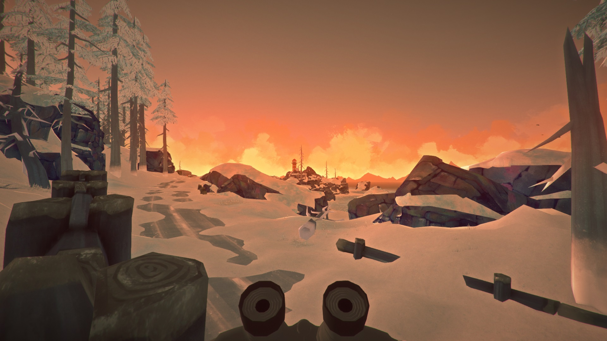
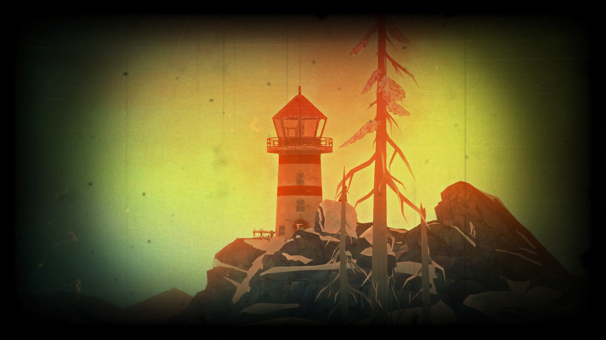

Binoculars

This is a mod for **The Long Dark** by Hinterland Games Studio, Inc.

It adds fully functional binoculars.

**Please note:** Currently the binoculars do not spawn naturally in the world, so they have be created manually, e.g. by using [DeveloperConsole](https://github.com/FINDarkside/TLD-Developer-Console)

This mod also requires [AssetLoader](https://github.com/WulfMarius/AssetLoader) and [ModComponent](https://github.com/WulfMarius/ModComponent), so your mod directory should contain:
- Binoculars.dll (this mod's DLL)
- binoculars (this mod's asset bundle)
- Assetloader.dll
- ModComponentAPI.dll
- ModComponentMapper.dll

To be installed like a mod as described by [Mod Loader](https://github.com/zeobviouslyfakeacc/ModLoaderInstaller).